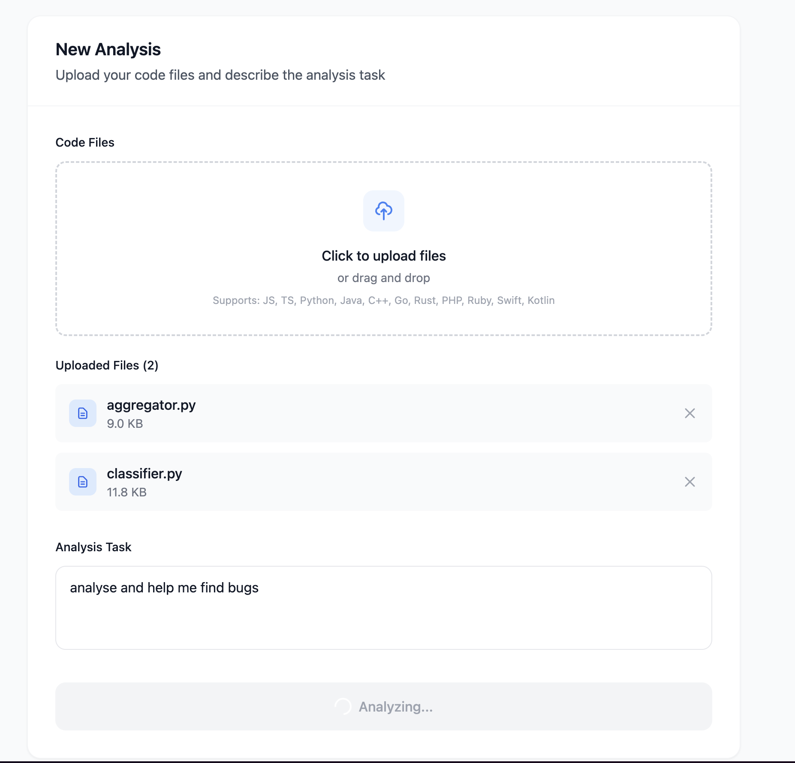
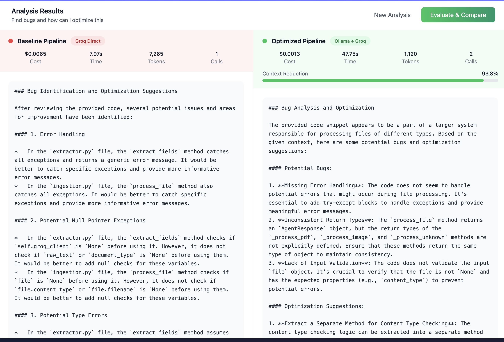
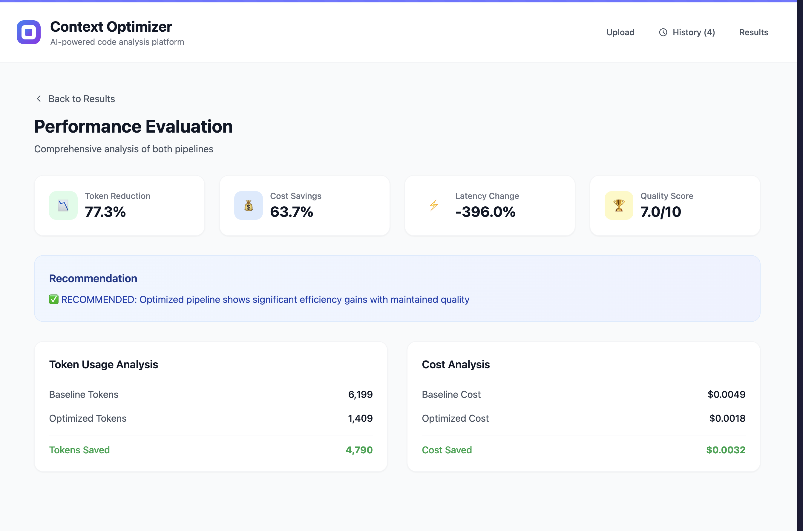

# Context-Optimized Coding Agent — Documentation

## Table of Contents

1. [Problem Statement](#1-problem-statement)
2. [Ideation & Approach](#2-ideation--approach)
3. [System Architecture](#3-system-architecture)
4. [Implementation Details](#4-implementation-details)
5. [API Reference](#5-api-reference)
6. [Frontend Dashboard](#6-frontend-dashboard)
7. [Output Screenshots](#7-output-screenshots)
8. [Setup & Running](#8-setup--running)

---

## 1. Problem Statement

Modern LLM-based coding assistants face a fundamental inefficiency: **they send the entire context to a large model, regardless of relevance**. When a developer asks "find the bug in this code" and pastes a 500-line file, the model processes every import statement, every comment, and every unrelated helper function — all at full cost.

This creates three compounding problems:

- **Token waste** — Large portions of the input context are irrelevant to the specific task, yet every token is billed.
- **Cost scaling** — As codebases grow, the cost per query grows linearly with context size. A 20K-token context costs 4× more than a 5K-token one, even if only 5K tokens are actually relevant.
- **Diminished focus** — Large models can lose focus when overwhelmed with irrelevant context, sometimes producing less accurate responses than they would with a focused input.

The question this project answers: **Can a small, cheap model pre-filter context so that a large model receives only what matters — and can we prove the improvement with measurable metrics?**

---

## 2. Ideation & Approach

### Core Idea

Instead of the traditional single-model approach:

```
Full Context ──────────────────────► Large Model ──► Output
                (expensive, noisy)
```

We introduce a two-stage pipeline:

```
Full Context ──► Small Model (filter) ──► Filtered Context ──► Large Model ──► Output
                 (cheap, local)              (focused, lean)     (expensive, precise)
```

The small model acts as a **context curator** — it reads the full input, identifies what's relevant to the task, and passes only that to the large model. The large model then reasons over a cleaner, more focused input.

### Why This Works

- **Small models are good at extraction.** Identifying relevant code sections, filtering logs, and summarizing context are tasks where a 7B-parameter model performs well.
- **Large models are good at reasoning.** Complex debugging, security analysis, and code generation benefit from the 70B model's deeper understanding — but only when the input is focused.
- **The cost math is favorable.** Running a local small model costs effectively $0. If it removes 50% of tokens before they reach the paid API, the savings are direct and immediate.

### What We Measure

To prove this isn't just theoretical, we run **both pipelines on the same input** and compare:

| Metric | What It Tells Us |
|--------|-----------------|
| Token Reduction % | How much context the small model removed |
| Cost Reduction % | Direct dollar savings from fewer tokens |
| Latency Change | Whether the filtering overhead is worth it |
| Quality Score (1–10) | Whether the output quality is maintained |

Quality is evaluated using an **LLM-as-judge** approach — a separate LLM call scores both outputs on correctness, completeness, clarity, and practicality.

---

## 3. System Architecture

### High-Level Architecture

```
┌─────────────────────────────────────────────────────────────────┐
│                        Frontend (React + Vite)                  │
│  ┌──────────┐  ┌──────────────┐  ┌────────────┐  ┌──────────┐  │
│  │  Upload   │  │   Results    │  │ Evaluation │  │ History  │  │
│  │   View    │  │    View      │  │    View    │  │   View   │  │
│  └────┬─────┘  └──────▲───────┘  └─────▲──────┘  └──────────┘  │
│       │               │                │                        │
│       └───────────────┼────────────────┘                        │
│                       │  HTTP (fetch)                           │
└───────────────────────┼─────────────────────────────────────────┘
                        │
                        ▼
┌─────────────────────────────────────────────────────────────────┐
│                    Backend (FastAPI :8006)                       │
│                                                                 │
│  ┌──────────────────────────────────────────────────────────┐   │
│  │                    API Endpoints                          │   │
│  │  GET /health    POST /baseline   POST /optimized          │   │
│  │                 POST /evaluate                            │   │
│  └──────┬──────────────┬──────────────────┬─────────────────┘   │
│         │              │                  │                     │
│         ▼              ▼                  ▼                     │
│  ┌─────────────┐ ┌───────────┐  ┌──────────────────┐           │
│  │   Health    │ │  Pipeline │  │   Evaluation     │           │
│  │   Monitor   │ │  Router   │  │     Engine       │           │
│  └─────────────┘ └─────┬─────┘  └────────┬─────────┘           │
│                        │                 │                     │
│              ┌─────────┴─────────┐       │                     │
│              ▼                   ▼       │                     │
│     ┌──────────────┐   ┌──────────────┐  │                     │
│     │   Baseline   │   │  Optimized   │  │                     │
│     │   Pipeline   │   │   Pipeline   │  │                     │
│     └──────┬───────┘   └──┬───────────┘  │                     │
│            │              │              │                     │
│            │         ┌────▼────────┐     │                     │
│            │         │   Context   │     │                     │
│            │         │  Processor  │     │                     │
│            │         └────┬────────┘     │                     │
│            │              │              │                     │
│            │         ┌────▼────────┐     │                     │
│            │         │   Ollama    │     │                     │
│            │         │  Service    │     │                     │
│            │         │ (Mistral)   │     │                     │
│            │         └─────────────┘     │                     │
│            │              │              │                     │
│            ▼              ▼              │                     │
│     ┌──────────────────────────────┐     │                     │
│     │       Groq Service           │◄────┘                     │
│     │    (LLaMA3-70B API)          │                           │
│     │  • Multi-key fallback        │                           │
│     │  • Token counting (tiktoken) │                           │
│     │  • Chunking for large input  │                           │
│     │  • Cost calculation          │                           │
│     └──────────────────────────────┘                           │
└─────────────────────────────────────────────────────────────────┘
                        │                    │
                        ▼                    ▼
              ┌──────────────┐     ┌──────────────────┐
              │  Groq Cloud  │     │  Ollama (Local)   │
              │  LLaMA3-70B  │     │  Mistral 7B       │
              │  (Reasoning) │     │  (Filtering)      │
              └──────────────┘     └──────────────────┘
```

### Data Flow — Baseline Pipeline

```
User Input (task + context)
        │
        ▼
   Full context sent directly to Groq LLaMA3-70B
        │
        ▼
   Groq returns response
        │
        ▼
   Count tokens (tiktoken), calculate cost
        │
        ▼
   Return PipelineResult { tokens, cost, latency, output }
```

### Data Flow — Optimized Pipeline

```
User Input (task + context)
        │
        ▼
   Context Processor analyzes context type
   (code? logs? errors? what language?)
        │
        ▼
   Builds specialized filtering prompt based on type
        │
        ▼
   Ollama Mistral filters context locally ($0 cost)
   Extracts: relevant code, errors, key sections
   Removes: boilerplate, unrelated imports, noise
        │
        ▼
   Filtered context sent to Groq LLaMA3-70B
        │
        ▼
   Groq reasons over focused input
        │
        ▼
   Return PipelineResult { tokens, cost, latency, output, context_reduction% }
```

### Data Flow — Evaluation

```
Same input runs through BOTH pipelines (in parallel)
        │
        ├──► Baseline Pipeline ──► baseline_result
        │
        └──► Optimized Pipeline ──► optimized_result
                    │
                    ▼
           Evaluation Engine compares:
           • Token reduction %
           • Cost reduction %
           • Latency difference
           • LLM-as-judge quality scoring (Groq scores both outputs 1–10)
                    │
                    ▼
           Returns EvaluationResult with metrics + recommendation
```

---

## 4. Implementation Details

### 4.1 Backend Services

#### Groq Service (`groq_service.py`)

The Groq service handles all communication with the Groq cloud API for large-model reasoning.

**Key design decisions:**

- **Multi-key fallback** — Supports multiple API keys (`GROQ_API_KEY`, `GROQ_API_KEY_2`). If one key hits a rate limit (HTTP 429), it automatically tries the next key and falls back to a smaller model (`llama-3.1-8b-instant`) if the 70B model is throttled.
- **Automatic chunking** — If the input exceeds 7,500 tokens (staying under Groq's 12K TPM limit with headroom for output), the context is split into chunks. Each chunk is processed separately, then a merge step synthesizes all chunk results into one coherent response. A 62-second delay between chunks respects the per-minute rate limit.
- **Token counting** — Uses `tiktoken` (the `cl100k_base` encoding) for accurate token counting before and after each call.
- **Cost calculation** — Computes cost at $0.0005/1K input tokens and $0.0015/1K output tokens.

#### Ollama Service (`ollama_service.py`)

The Ollama service runs the local Mistral model for context filtering.

**Key design decisions:**

- **Local inference** — Runs on `localhost:11434`, meaning zero API cost for filtering operations.
- **Structured output parsing** — The filtering prompt asks the model to respond in a structured format (`RELEVANT_CONTEXT:`, `SUMMARY:`, `REDUCTION:`). The service parses this to extract the filtered context. If parsing fails, it falls back to using the full model response.
- **Graceful degradation** — If Ollama is unavailable, the service returns the original context unfiltered rather than failing the entire request.
- **Auto model pull** — If the Mistral model isn't loaded, the service attempts to pull it automatically.

#### Context Processor (`context_processor.py`)

The context processor sits between the user input and Ollama, adding intelligence to the filtering process.

**Key design decisions:**

- **Context type detection** — Uses regex patterns to classify the input as `code`, `logs`, `error_report`, `code_with_errors`, or `text`. It also detects the programming language (Python, JavaScript, Java, C/C++).
- **Specialized prompts** — Each context type gets a tailored filtering prompt. For code with errors, the prompt emphasizes stack traces and the error location. For logs, it focuses on error entries and timestamps. For plain code, it prioritizes functions related to the task.
- **Large context chunking** — Contexts over 50K characters are split into 15K-character chunks (splitting at line boundaries to avoid breaking code). Each chunk is filtered independently, then the results are combined.
- **Reduction tracking** — Calculates the actual character-level reduction percentage by comparing original vs. filtered context length.

#### Evaluation Engine (`evaluation_engine.py`)

The evaluation engine provides objective comparison between the two pipelines.

**Key design decisions:**

- **LLM-as-judge** — Uses a separate Groq API call to score both outputs on four criteria (correctness, completeness, clarity, practicality) on a 1–10 scale. The evaluation prompt presents both outputs side-by-side to the judge model.
- **Performance metrics** — Calculates token reduction %, cost reduction %, latency improvement %, tokens-per-second, and cost-per-token for both pipelines.
- **Automated recommendation** — Based on the metrics, generates a recommendation:
  - ✅ RECOMMENDED if >30% token reduction, >25% cost reduction, and quality maintained
  - 👍 BENEFICIAL if moderate improvements with no quality loss
  - ⚠️ CAUTION if quality drops significantly
  - ❓ MARGINAL if gains are minimal

### 4.2 Frontend Dashboard

#### Technology Stack

- **React 18** with TypeScript for type-safe component development
- **Vite** for fast development builds and HMR
- **Tailwind CSS** for utility-first styling
- **Recharts** for data visualization (bar charts, radar charts)
- **Lucide React** for consistent iconography

#### Application Views

The dashboard has four views, managed by a `viewMode` state:

1. **Upload View** — File upload (drag-and-drop, multi-file), task description input, and the "Start Analysis" button. Accepts `.js`, `.ts`, `.py`, `.java`, `.cpp`, `.go`, `.rs`, `.php`, `.rb`, `.swift`, `.kt`, and config files.

2. **Results View** — Split-screen comparison showing baseline (left, red-themed) and optimized (right, green-themed) results side by side. Each panel shows cost, latency, token count, model calls, and the full output. The optimized panel also shows a context reduction progress bar.

3. **Evaluation View** — Detailed metrics dashboard with summary cards (token reduction, cost savings, latency change, quality score), the engine's recommendation, and breakdowns of token usage and cost analysis.

4. **History View** — Lists the last 10 analysis sessions stored in `localStorage`. Each entry shows the task, timestamp, file count, and a "View" button to reload the results.

#### How the Frontend Calls the Backend

When the user clicks "Start Analysis":

1. All uploaded files are concatenated into a single context string (prefixed with filenames).
2. Two `fetch` calls fire **in parallel** — one to `POST /baseline`, one to `POST /optimized`.
3. Both results are stored in state and the view switches to Results.
4. The analysis is saved to `localStorage` for the History view.
5. If the user clicks "Evaluate & Compare", a third call to `POST /evaluate` runs both pipelines again with LLM-as-judge scoring.

---

## 5. API Reference

**Base URL:** `http://localhost:8006`

### `GET /health`

Check the health of all backend services.

**Response:**
```json
{
  "status": "healthy",
  "services": {
    "groq": {
      "status": "healthy",
      "message": "Groq API is responding",
      "response_time": 0.45
    },
    "ollama": {
      "status": "healthy",
      "message": "Ollama running with model mistral",
      "response_time": 0.02
    }
  }
}
```

Service status values: `healthy`, `degraded`, `unhealthy`.

---

### `POST /baseline`

Run the baseline pipeline (full context → Groq directly).

**Request Body:**
```json
{
  "task": "Find the bug in this code",
  "context": "def calculate(x, y):\n    return x / y"
}
```

| Field | Type | Description |
|-------|------|-------------|
| `task` | string | The coding task to perform |
| `context` | string | Full code/logs/text context |

**Response:**
```json
{
  "pipeline_type": "baseline",
  "task": "Find the bug in this code",
  "input_tokens": 1250,
  "output_tokens": 380,
  "total_tokens": 1630,
  "cost": 0.0012,
  "latency": 3.42,
  "output": "The bug is a potential ZeroDivisionError...",
  "model_calls": 1,
  "context_reduction": null,
  "timestamp": "2026-05-04T01:30:00.000Z"
}
```

---

### `POST /optimized`

Run the optimized pipeline (context → Ollama filter → Groq).

**Request Body:** Same as `/baseline`.

**Response:**
```json
{
  "pipeline_type": "optimized",
  "task": "Find the bug in this code",
  "input_tokens": 520,
  "output_tokens": 350,
  "total_tokens": 870,
  "cost": 0.0005,
  "latency": 5.10,
  "output": "The function lacks a zero-division guard...",
  "model_calls": 2,
  "context_reduction": 58.4,
  "timestamp": "2026-05-04T01:30:05.000Z"
}
```

| Field | Type | Description |
|-------|------|-------------|
| `context_reduction` | float | Percentage of context removed by the small model |
| `model_calls` | int | Always 2 (Ollama + Groq) |

---

### `POST /evaluate`

Run both pipelines and compare with LLM-as-judge quality scoring.

**Request Body:** Same as `/baseline`.

**Response:**
```json
{
  "baseline_result": { "...PipelineResult..." },
  "optimized_result": { "...PipelineResult..." },
  "metrics": {
    "performance": {
      "token_metrics": {
        "baseline_tokens": 1630,
        "optimized_tokens": 870,
        "tokens_saved": 760,
        "token_reduction_percent": 46.6
      },
      "cost_metrics": {
        "baseline_cost": 0.0012,
        "optimized_cost": 0.0005,
        "cost_saved": 0.0007,
        "cost_reduction_percent": 58.3
      },
      "performance_metrics": {
        "baseline_latency": 3.42,
        "optimized_latency": 5.10,
        "latency_improvement": -1.68,
        "latency_improvement_percent": -49.1
      },
      "model_calls": {
        "baseline_calls": 1,
        "optimized_calls": 2
      },
      "context_reduction": 58.4
    },
    "quality": {
      "baseline_score": 8.0,
      "optimized_score": 8.0,
      "analysis": "Both responses correctly identify the division-by-zero risk...",
      "criteria_scores": {
        "correctness": { "baseline": 8, "optimized": 8 },
        "completeness": { "baseline": 7, "optimized": 8 },
        "clarity": { "baseline": 8, "optimized": 8 },
        "practicality": { "baseline": 7, "optimized": 8 }
      }
    },
    "summary": {
      "token_reduction_percent": 46.6,
      "cost_reduction_percent": 58.3,
      "latency_improvement_percent": -49.1,
      "quality_difference": 0.0,
      "context_reduction_percent": 58.4
    },
    "recommendation": "✅ RECOMMENDED: Optimized pipeline shows significant efficiency gains with maintained quality"
  }
}
```

---

## 6. Frontend Dashboard

### Views Overview

| View | Purpose | Key Features |
|------|---------|-------------|
| **Upload** | Input entry point | Multi-file upload, task description, file list with sizes |
| **Results** | Side-by-side comparison | Split-screen baseline vs optimized, metrics per pipeline, context reduction bar |
| **Evaluation** | Deep metrics analysis | Summary cards, token/cost breakdowns, recommendation banner |
| **History** | Session recall | Last 10 analyses in localStorage, one-click reload |

### Component Architecture

```
App.tsx (state management, view routing)
├── Header (navigation tabs)
├── Upload View
│   ├── File upload dropzone
│   ├── Uploaded files list
│   └── Task textarea + submit button
├── Results View
│   ├── Baseline panel (red theme)
│   │   └── Metrics row + output display
│   └── Optimized panel (green theme)
│       └── Metrics row + context reduction bar + output display
├── Evaluation View
│   ├── Summary metric cards (4x)
│   ├── Recommendation banner
│   ├── Token usage analysis card
│   └── Cost analysis card
└── History View
    └── Analysis session cards with "View" buttons
```

---

## 7. Output Screenshots

### Upload View
The entry point where users upload code files and describe their analysis task.



### Results — Side-by-Side Comparison
Split-screen view showing baseline (left) and optimized (right) pipeline outputs with per-pipeline metrics.



### Evaluation — Performance Metrics
Detailed evaluation dashboard showing token reduction, cost savings, latency, quality scores, and the engine's recommendation.



---

## 8. Setup & Running

### Prerequisites

- Python 3.8+
- Node.js 18+
- Ollama installed and running (`ollama serve`)
- Groq API key (from [console.groq.com](https://console.groq.com))

### Quick Start

```bash
# Clone and enter the project
git clone https://github.com/sharunikaaorg/coding_agent.git
cd coding_agent

# One-command launch
./start.sh
```

### Manual Setup

**Backend:**
```bash
cd backend
pip install -r requirements.txt
cp .env.example .env        # Add your GROQ_API_KEY
ollama pull mistral          # Download the small model
python run.py                # Starts on :8006
```

**Frontend:**
```bash
cd frontend
npm install
npm run dev                  # Starts on :5173
```

### Access Points

| Service | URL |
|---------|-----|
| Frontend Dashboard | http://localhost:5173 |
| Backend API | http://localhost:8006 |
| API Docs (Swagger) | http://localhost:8006/docs |
| Ollama | http://localhost:11434 |

### Environment Variables

| Variable | Required | Description |
|----------|----------|-------------|
| `GROQ_API_KEY` | Yes | Primary Groq API key |
| `GROQ_API_KEY_2` | No | Fallback Groq API key for rate limit handling |
| `OLLAMA_BASE_URL` | No | Ollama server URL (default: `http://localhost:11434`) |
